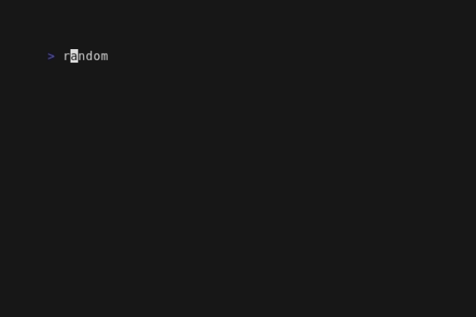

# 🏃🏽‍♀️🏃🏾‍♂️🏃🏻‍♀️💨 **_⸻ RUN_**


[](https://amonks.github.io/run)
[](https://goreportcard.com/report/github.com/amonks/run)

RUN is a task runner that simplifies executing and managing tasks defined in `tasks.toml` files. It provides a versatile set of features making it well suited for a range of use cases, from simple build scripts to complex development workflows.


## Features

- **Flexible Task Configuration**: Support for complex task dependencies, environment variable injection, and file watching for automatic task re-execution.
- **Interactive TUI**: Full mouse support for managing long-lived tasks.
- **Non-Interactive Output**: Interleaved output suitable for short-lived processes.
- **Go API**: Extensibility through a Go programming interface.

## Installation

RUN can be installed as a single binary or via the Go command line tool:

### Pre-compiled binary

Download the latest release from the [releases page](https://github.com/amonks/run/releases), and extract the binary to a directory in your `PATH`. This can be done in a single command like:

    $ curl -sL https://github.com/amonks/run/releases/download/<RELEASE_VERSION>/run_<RELEASE_ARCH>.tar.gz | tar -x && chmod +x run && mv run ~/go/bin

### Using Go

If you already use go and have it installed, you can install RUN with the go command line tool.

    $ go install github.com/amonks/run/cmd/run@latest

## Quick Start

Follow these steps to get started with RUN:

1. **Create a `tasks.toml` file**
    
        $ touch tasks.toml

2. **Define a task in that `tasks.toml`**
    ```toml
    [[task]]
      id = "hello"
      type = "short"
      cmd = "echo Hello, World!"
    ```

3. **Run the task and see task output**
      
    

## Configuration

Run is configured through tasks.toml files. Here's a brief overview of the key fields in a task definition:

_Required Fields_:

- `id`: Unique identifier for the task.
- `type`: Specifies the task type (long or short).

_Optional Fields_:

- `dependencies`: Other tasks to run alongside this task.
- `triggers`: Tasks that, when completed successfully, will cause this task to re-execute.
- `watch`: File paths to monitor for changes, triggering task restarts.
- `env`: Environment variables for the task's execution context.
- `cmd`: The command to run, may contain multiple lines.

For explanations about task fields and behavior head to the [Task Management]() section, or for realistic configurations head over to the [Examples](https://amonks.github.io/run/examples) directory.

## CLI Usage

Run a task simply by specifying its ID:

    $ run <task-id>

Available flags are:
<!-- usage-start -->
```
USAGE
     
  run [flags] <task>

     
FLAGS
     
  -contributors
        Display the contributors list and exit.
  -credits
        Display the open source credits and exit.
  -dir=string (default ".")
        Look for a root taskfile in the given directory.
  -help
        Display the help text and exit.
  -license
        Display the license info and exit.
  -list
        Display the task list and exit. If run is invoked
        with both -list and a task ID, that task's
        dependencies are displayed.
  -ui=string
        Force a particular ui. Legal values are 'tui' and
        'printer'.
  -version
        Display the version and exit.
```
<!-- usage-end -->

## User Interfaces

Run has two UIs that it deploys in different circumstances, a TUI and a
Printer. You can force Run to use a particular UI by passing the 'ui' flag,
as in,

    $ run -ui=printer dev

### Interactive TUI


The Interactive TUI is used whenever both,

1. stdout is a tty (eg Run is _not_ being piped to a file), and,
2. any running task is "long" (eg an ongoing "dev server" process rather than a
   one-shot "build" procedure).

For example, when running a dev server or test executor that stays running
while you make changes.

### Non-Interactive Printer UI

| in your terminal...                                                                                                 | or as part of a pipeline...                                                                                   |
| ------------------------------------------------------------------------------------------------------------------- | ------------------------------------------------------------------------------------------------------------- |
|  |  |

Run prints its output if either,

1. run is not a tty (eg Run is being piped to a file), or,
2. no tasks are "long" (eg a one-shot "build" procedure, rather than an ongoing
   "dev server").

## Programmatic Use

Run can be used and extended programmatically through its Go API. For more
information, including a conceptual overview of the architecture, example code,
and reference documentation, see [the godoc][godoc].

[godoc]: https://amonks.github.io/run

# Attribution and License

Run is free for noncommercial and small-business use, with a guarantee that
fair, reasonable, and nondiscriminatory paid-license terms will be available
for large businesses. Ask about paid licenses at a@monks.co. See LICENSE.md or
invoke the program with `-license` for more details.

Run is made by Andrew Monks, with help from outside contributors. See
CONTRIBUTORS.md for more details.

Run makes use of a variety of open source software. See CREDITS.txt for more
details.