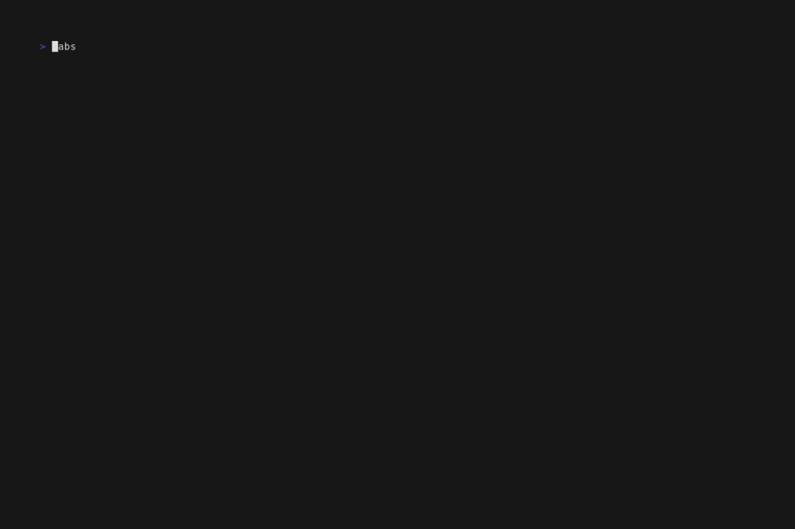
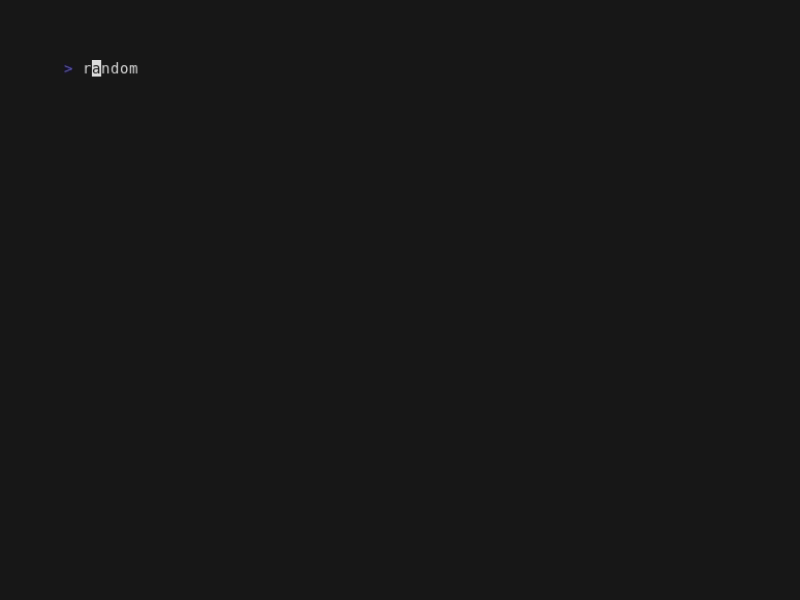
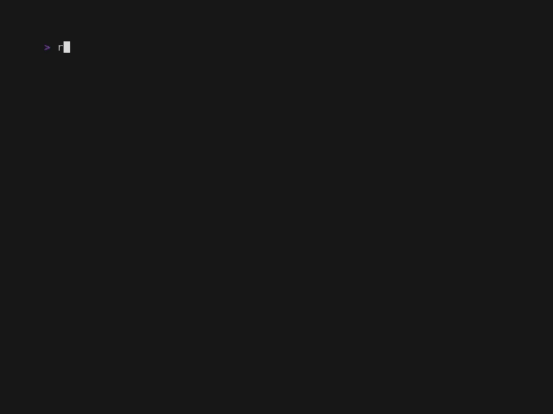

# Golang Project Template with Run

This README provides instructions on how to bootstrap a new Golang project using a predefined Taskfile. The Taskfile includes tasks for bootstrapping the go project, building, testing, cleaning, and running the application, as well as a task that watches for changes to `.go` files and rebuilds the application automatically.

## Prerequisites

- Go 1.21 or higher installed on your system.
- [Run](https://github.com/amonks/run) installed for managing tasks.

## Setting Up Your Project

1. **Download the Taskfile**: First, create a new directory for your project and download the `tasks.toml` file into this directory. You can use `curl` to download the file directly from the repository:

   ```shell
   mkdir my-new-go-project
   cd my-new-go-project
   curl -O https://raw.githubusercontent.com/amonks/run/main/examples/golang-app/tasks.toml
   ```

2. **Set Required Environment Variables**: Before running the bootstrap task, you need to set an environment variable for the module path, from which the project name is derived. Replace `<your_project_name>`, `<your_github_username>` with your project's name, your GitHub username, for a standard module path, alternatively use your preferred module path. 

   ```shell
   export GO_MODULE_PROJECT_PATH=github.com/<your_github_username>/<your_project_name>
   ```

3. **Bootstrap Your Project**: Execute the bootstrap task to set up a basic Go project structure, including initializing the Go module, creating a basic `.gitignore`, and setting up a simple `main.go` file.

        $ run bootstrap

   This task checks for the necessary environment variables, ensures there's no existing Go module or project structure that would conflict, and then sets up your new Go project.

    


## Building and Running Your Application

After bootstrapping your project, you can utilize other tasks defined in the `tasks.toml` file.

- **Build the application**:
  
      $ run build

  This will compile your Go application and place the binary in the `./bin` directory.

  

- **Run tests**:
  
      $ run test

  This executes all Go tests in your project. (Note, there are no tests in the initial project structure.)

  

- **Clean up**:
  
      $ run clean

  Removes the binary and cleans the Go test and module cache.

  

- **Run the application in development mode**:
  
      $ run dev

  Builds and runs the binary, and watches for changes to `.go` files to rebuild automatically. The gif below shows the application running in development mode with a simulated change to the `main.go` file happening in the background.

  

## Next Steps

Now that your project is set up, you can start developing your Go application. Modify the `main.go` file to begin adding application logic. As you develop, use the tasks defined in the `tasks.toml` file to build, test, and run your application. As the project evolves you can add new tasks to the `tasks.toml` file to automate additional tasks.

For more information on the implementation and usage of Run, refer to the [Run documentation](https://github.com/amonks/run).

---

Happy coding! 🏃
